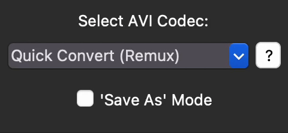

# Video To AVI for MacOS

very simple GUI app for MacOS that converts videos into a .AVI container with various codecs to choose from using FFMPEG.

## Licenses

This software is distributed under the terms of the [MIT License](LICENSE).

Third-party components used in this software may have their own licenses. 
Please refer to the following for more information:

- [FFmpeg License](https://ffmpeg.org/legal.html)

## Downloadable Build
[Download Here](https://github.com/n8ventures/video-to-AVI-MacOS/releases/latest)

## Using Python
- Written with Python 3.12.3
- run `pip3 install -r requirements.txt` to install the modules
- run `python main.py`

## How To Use

### 1. Before we import our videos, select our preferred codec!

You can also learn more information about the codec you'll be implimenting!

For more information regarding about the codecs, check [here](#codecs) or keep on scrolling!

### The 'Save As' checkbox!

- Activating this will ask you which directory to save (not each file, since that would be *really* annoying).

### 2. Import your video file and wait for conversion!

- You may choose between clicking the area of the app or drag-and-drop it!

#### Drag-and-drop

#### Click to import

### 3. Done!

Video is converted to AVI!

## Codecs

Here's a quick overview of what each codec does, but I advise to do more research before you choose the right one.

- To test, I used a 200MB h.264 video lasting about a minute and a half to convert and here's my results. Note that your experience may vary.

| Codec | Speed | Size | Lossless | Description | Usage |
| :---: | :---: | :---: | :---: | --- | --- |
| **copy** (Quick Convert/Remux) | Very Fast | Identical | ❓[*](#depends-on-the-video-codec-from-the-original-video) |  Uses the video's built-in codec. No re-encoding is processed. | For fast conversion without quality loss. Use this if you know the original codec used in the video. |
| **utvideo** | Fast | Significantly Larger | ✅ | Lossless codec with high compression ratios and speed. Supports various color spaces and is designed for high performance. | Ideal for video editing and archiving where lossless quality is required, especially for intermediate files. |
| **rawvideo**  | Fast | Much Larger | ✅ |  Uncompressed video. Provides the highest quality but results in very large file sizes.  *This is the equivalent of Adobe After Effect's 'None (Uncompressed)' codec on AVI.* | Used for video editing and archiving when quality is paramount. |
| **qtrle** (QuickTime Animation) | Very Slow | Significantly Larger | ✅ | RLE (Run-Length Encoding) based codec, typically used for animated content with low motion. | Best used for animations and simple graphics where compression efficiency is prioritized over high motion detail.  *However, please do note that this is a really dated codec, and I'd advise you choose a different lossless codec.* |
| **prores** (Apple ProRes) | Fast | Larger | ❌ |  A high-quality, lossy codec widely used in professional video production for its efficient balance between file size and quality. | Commonly used in post-production and broadcasting for its ease of editing and high visual fidelity. |
| **huffyuv** | Fast | Significantly Larger | ✅ |  A lossless video codec that compresses RGB video data without losing quality. | Preferred for scenarios where lossless quality is essential but some file size reduction is beneficial.
| **libx264** (H.264) | Slow | Much Smaller | ❌ | A highly efficient video compression standard, widely used for streaming, video storage, and digital distribution. | The go-to codec for streaming, web video, and general video storage due to its high compression efficiency. |
| **mpeg4** (MPEG-4) | Fast | Smaller | ❌ | A widely used codec for internet video, digital distribution, and some portable media players. | Versatile for various video applications, though often replaced by H.264 and other modern codecs in new projects. |
| **mjpeg** | Slow | Larger | ❌ | A codec that encodes video as a series of JPEG images, often used in older video capture devices. | Common in video capture, surveillance, and devices with limited processing power where simplicity is key. |
| **cfhd** (CineForm) | Fast | Significantly Larger | ❌ | A high-quality, lossy codec optimized for video editing, balancing compression and quality. | Used in professional video editing workflows, especially for intermediate files during post-production. |

##### **Depends on the video codec from the original video.*